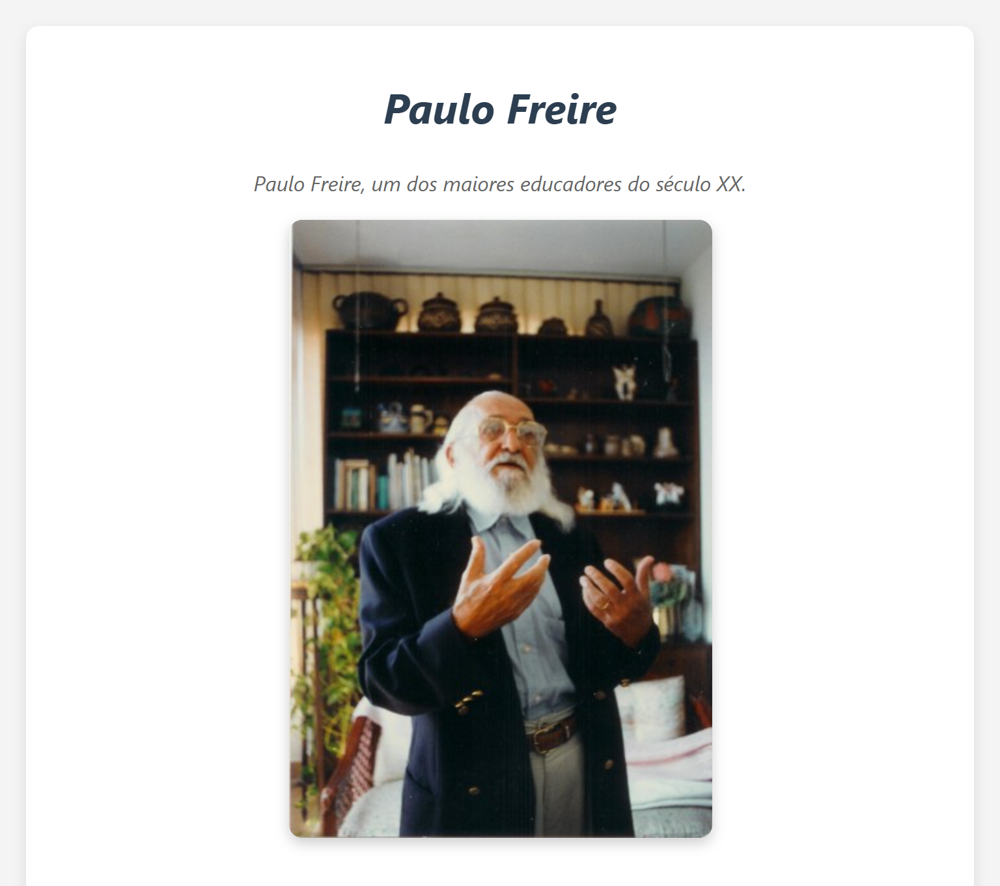

# 🚀 freeCodeCamp Projects

Bem-vindo ao meu repositório de projetos do freeCodeCamp! Aqui, vou compartilhar todos os projetos que desenvolvi enquanto estudo na plataforma freeCodeCamp. Este repositório serve como um portfólio dos meus aprendizados e progressos. 🌟

## 📚 Sobre o freeCodeCamp

O [freeCodeCamp](https://www.freecodecamp.org/) é uma plataforma de aprendizado de programação que oferece cursos gratuitos em diversas áreas, como desenvolvimento web, ciência de dados, machine learning e muito mais. Cada curso é acompanhado de projetos práticos que ajudam a consolidar o conhecimento adquirido. 🖥️📊🤖

## 🛠️ Projetos

Aqui está a lista dos projetos que já concluí:

### 1. [📋 Formulário de Adoção de Animais](https://free-code-camp-ivory.vercel.app/Projects/survey-form/survey-form.html) 🎉

- **📝 Descrição**: Um formulário interativo e responsivo para adoção de animais, com validações HTML5 e design amigável.
- **🛠️ Tecnologias utilizadas**: **HTML5** e **CSS3**.
- **🔗 Link para o projeto**: [Clique aqui para ver o projeto](https://free-code-camp-ivory.vercel.app/Projects/survey-form/survey-form.html)

---

### 2. [🌟 Página de Tributo a Paulo Freire](https://free-code-camp-ivory.vercel.app/Projects/tribute-page/index.html)

- **📝 Descrição**: Uma página de tributo moderna e responsiva dedicada ao educador Paulo Freire, com design limpo e informações sobre sua vida e obra.
- **🛠️ Tecnologias utilizadas**: **HTML5** e **CSS3**.
- **🔗 Link para o projeto**: [Clique aqui para ver o projeto](https://free-code-camp-ivory.vercel.app/Projects/tribute-page/index.html)

## 🚀 Como usar este repositório

Cada projeto está organizado em sua própria pasta, com um `README.md` específico que detalha o projeto, as tecnologias utilizadas e como executá-lo localmente. Siga as instruções de cada projeto para começar! 📂

## 🤝 **Contribuições**

Se você tiver alguma sugestão ou encontrar algum problema em algum dos projetos, sinta-se à vontade para abrir uma [issue](https://github.com/BrianMunizSilveira/freeCodeCamp/issues) ou enviar um [pull request](https://github.com/BrianMunizSilveira/freeCodeCamp/pulls). Sua contribuição é muito bem-vinda! 💡

## 📜 Licença

Este repositório está licenciado sob a licença MIT. Veja o arquivo [LICENSE](LICENSE) para mais detalhes.

---

Feito com ❤️ por [Brian Muniz Silveira](https://github.com/BrianMunizSilveira) 🚀
